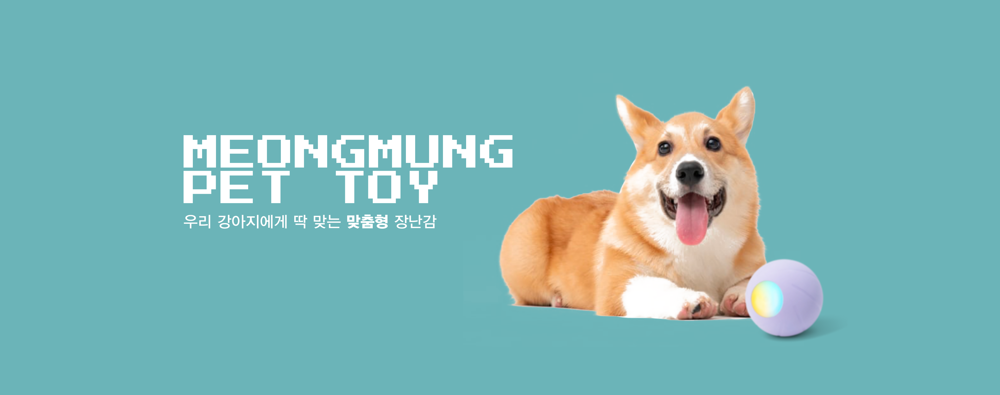

# 강아지 전용 용품 판매 사이트 - 멍뭉 (MEONG MUNG)

 

# 👀 서비스 링크 

### [멍뭉 (MEONG MUNG)](http://kdt-sw-7-team06.elicecoding.com/)

 

# 🎉 서비스 소개 
### 환영합니다! 저희는 강아지를 처음 키우시는 분들 에게 맞춤형 서비스를 제공하고 있습니다. 
저희 사이트는 사용자의 강아지에 대한 기본 정보를 바탕으로 최적의 상품을 추천합니다.
강아지의 나이, 품종, 크기 밒 건강 상태와 같은 정보를 입력하시면, 저희는 이 데이터를 활용해 각각의 필요에 가장 적합한 제품을 선별여 추천 카테고리에 제안합니다.

 

# ✨ 주요 기능

### 1. 상품 추천 기능

### 2. 여러 배송지 관리 기능

### 3. 반응형 웹 페이지 

 

## 🗓️ 프로젝트 기간

2023.10.30(월) ~ 2023.11.12(일)

# 🥁 기술 스택

### Backend

### Frontend

### Infrastructure

### 협업 툴

 
 

# 💡 개발 기획

### [페르소나](https://powerful-lamprey-ff8.notion.site/e0151c1609d341049e782c5eea1d765e?pvs=4)

### [기능 명세서](https://powerful-lamprey-ff8.notion.site/a51faeb489a64261b0c1a8fd6fc7c0ad?v=c173ef4fe0024b25a12343c69436afc1&pvs=4)

### [API 명세서](https://docs.google.com/spreadsheets/d/1LqkCV7YfaV5iB-aKls27ZKXOTpCMf13k6AHyenMrOFU/edit?usp=sharing)

### [ERD 문서](https://www.erdcloud.com/d/tr3ez4Mp5Rkc6t8Zu)

### [Figma 와이어프레임](https://www.figma.com/file/uuNNVnJPOL79d7wsaKdsXB/Untitled?type=design&node-id=0%3A1&mode=design&t=IayrWPxWn7Y4I1Mc-1)

 

# 🐶 멍뭉이들 (Members)

### - 구기윤 [ BE ], [ FE ]
### - 강한나 [ BE ], [ FE ]
### - 홍소현 [ FE ]
### - 채유림 [ FE ]
### - 윤성원 [ FE ]